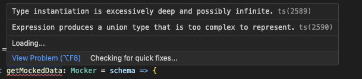

# How can I apply `FromSchema` on generics?

Let's say that your are building a library on top of JSON Schemas, for instance a function that builds mocked data from schemas. You might want to benefit from inferred typings thanks to `json-schema-to-ts`:

```ts
import type { FromSchema, JSONSchema } from "json-schema-to-ts";

type Mocker = <SCHEMA extends JSONSchema>(schema: SCHEMA) => FromSchema<SCHEMA>;

const getMockedData: Mocker = schema => {
  ... // logic here
};

const dogSchema = {
  type: "object",
  ... // schema here
} as const;

const dogMock = getMockedData(dogSchema);
```

Sadly, for some reasons that I don't fully grasp, TypeScript will raise an `type instantiation is excessively deep and possibly infinite` error:



You can still make it work by adding a second generic with the corresponding default:

```ts
import { FromSchema, JSONSchema } from "json-schema-to-ts";

type Mocker = <SCHEMA extends JSONSchema, DATA = FromSchema<SCHEMA>>(
  schema: SCHEMA,
) => DATA;

const getMockedData: Mocker = schema => {
  ... // logic here
};

const dogSchema = {
  type: "object",
  ... // schema here
} as const;

// 🙌 Will work!
const dogMock = getMockedData(dogSchema);
```
